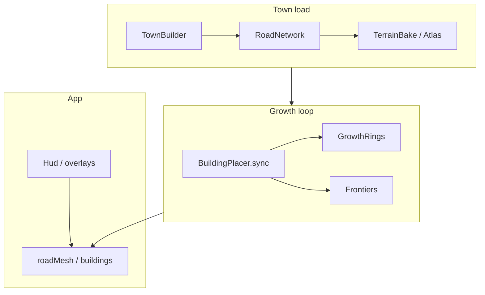

# Plot Test — Documentation

Structured system docs for town generation, terrain, placement, and growth. Each page follows: **Purpose → What → How → Interactions**.

**Start here:** [Architecture overview](architecture/overview.md) · **Authoritative placement rules:** [placement/rules.md](placement/rules.md)

## System flow

## Index

| Path | Topic |
|------|--------|
| [architecture/overview.md](architecture/overview.md) | End-to-end pipeline |
| [architecture/data-model.md](architecture/data-model.md) | `Town`, `Road`, `Plot`, frontage |
| [architecture/constraints.md](architecture/constraints.md) | World units, Voronoi library boundary |
| [town-generation/road-graph.md](town-generation/road-graph.md) | Voronoi → split → cull |
| [town-generation/water-and-bridges.md](town-generation/water-and-bridges.md) | Sanitize, waterside, bridges, reveal |
| [town-generation/terrain/overview.md](town-generation/terrain/overview.md) | Terrain goals and types |
| [town-generation/terrain/bake-and-atlas.md](town-generation/terrain/bake-and-atlas.md) | PNG → `TerrainAtlas` |
| [town-generation/terrain/queries.md](town-generation/terrain/queries.md) | Buildability, outlines, YAML fields |
| [town-generation/terrain/corridors.md](town-generation/terrain/corridors.md) | Shore/river corridor roads |
| [placement/rules.md](placement/rules.md) | **Authoritative** placement rules |
| [placement/sync-pipeline.md](placement/sync-pipeline.md) | `BuildingPlacer::sync` flow |
| [placement/zones-and-rings.md](placement/zones-and-rings.md) | Hop bands, ring bump |
| [placement/frontage-and-plots.md](placement/frontage-and-plots.md) | Segments, depth, carving |
| [placement/alleys-and-gap-fill.md](placement/alleys-and-gap-fill.md) | Secondary roads, gap-fill |
| [placement/terrain-buildings.md](placement/terrain-buildings.md) | Border/scan/any routing |
| [placement/frontiers.md](placement/frontiers.md) | `FrontierManager`, buckets |
| [growth/queue-and-controls.md](growth/queue-and-controls.md) | Queue, slider, auto-grow |
| [app/rendering-and-debug.md](app/rendering-and-debug.md) | Overlays, HUD keys |
| [config/reference.md](config/reference.md) | Consolidated YAML keys |

Agent cheat sheet: [`AGENTS.md`](../AGENTS.md).

## Current capability status

| Area | Status |
|------|--------|
| Voronoi road graph + junction indexing | Done |
| Terrain bake (`TerrainAtlas`, buildability, outlines) | Done |
| Water sanitize + corridor roads + parallel cull | Done |
| Bridge pairing, snap, growth reveal buckets | Done |
| Road-only frontage, plots, carving | Done |
| Hop-ring growth (core / suburban / rural) | Done |
| Placement frontiers (plot/wall/alley/scan/border) | Done |
| Terrain-first rural + `type: any` border/scan | Done |
| Alley creation + gap-fill (core densify) | Done |
| Movable building relocation on ring bump | Done |

## Future work

Ideas not implemented or only partially done:

- **`FeatureAnchor` placement mode** — river/shore centerline anchors instead of border frontage (watermill/fisher today use border placer).
- **`terrainAffinity` / grid coverage scoring** in `scoreSegmentForZone` — soft biome preference on vanilla frontier path.
- **`distToRiver` / `distToShore`** dedicated APIs (outline distance used today).
- **Serialized terrain atlas cache** (`terrain_atlas.bin` keyed by image hash).
- **Voronoi site bias** away from water at generation time.
- **Real-time terrain editing**, hydrology simulation.

Update this section when adding features; do not maintain a separate roadmap checklist.
